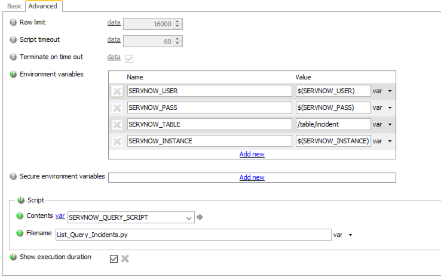

# ServiceNow Integration Overview  
The ability to automated geneos alert messages into your ServiceNow environment, and the ability to analyze.

### Contents
- Toolkit Samplers:
  - *TableName*-Open - List of Tickets that are not closed or not solved
  - *TableName*-OnHold - List of Tickets that are "On Hold"
  - *TableName*-InProgress - List of tickets that are "InProgress"

#### Requirements
You must have python 3.5 or higher to install:

`$ python -V`

This script does depend on the requests and pysnow module [pysnow](https://github.com/rbw/pysnow):

`$ pip install pysnow`

There are instructions on the web on how to

#### Installation
1. Open up the Gateway Setup Editor
2. In the Gateway Setup Editor, right click on the "Includes" folder, then add a new include.
3. Enter in the path to the ServiceNow Template and change the priority (to something other than 1).
4. Load the ServiceNow include file by clicking on the plus sign by the new file, and then clicking "Click to load...".
5. The template uses the following variables whose default values are defined under:
    `servicenowMonitoring.xml -> Environments -> ServiceNow`

#### Configuration
Each toolkit sampler you must configure appropriate TableSpace name, username, password, and ServiceNow instance name. Below is an example of view of a configured toolkit.

Variable values are configured in the `ServiceNow` Environment table. 
